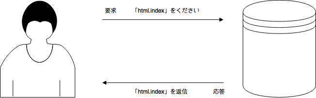
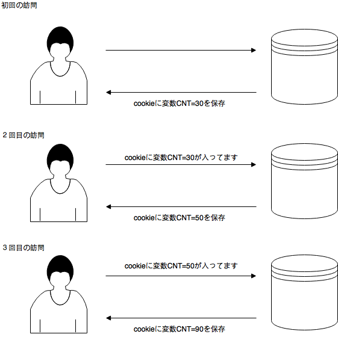

# ログインの必要なサイトからダウンロード
## HTTP通信
要求に対して応答を返すだけ。基本的に同じURLへのアクセスに対して、同じデータが返される通信(ストレートレス)。以前どのようなデータをやりとりしたかなどの情報は保持しない。

## クッキー
Webブラウザーを通してサイトの訪問者のコンピュータに一時的なデータを書き込んで保存するための仕組み。しかし、データをなんでも保存できるわけではなく、一つのクッキーに保存できる最大のデータは4096バイトに制限されている。クッキーは、HTTP通信のヘッダーを介して入出力されることになっており、訪問者側で容易にデータの改変が可能。

## セッション
