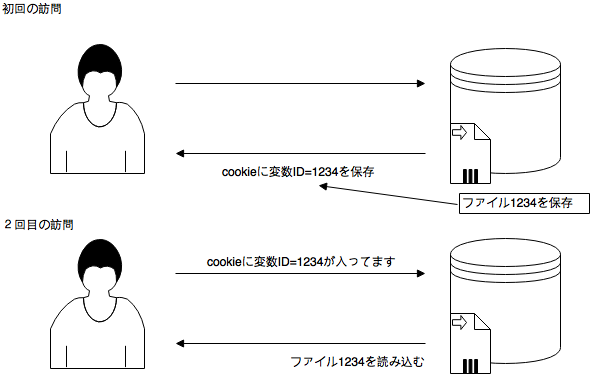

# ログインの必要なサイトからダウンロード
## HTTP通信
要求に対して応答を返すだけ。基本的に同じURLへのアクセスに対して、同じデータが返される通信(ストレートレス)。以前どのようなデータをやりとりしたかなどの情報は保持しない。

## クッキー
Webブラウザーを通してサイトの訪問者のコンピュータに一時的なデータを書き込んで保存するための仕組み。しかし、データをなんでも保存できるわけではなく、一つのクッキーに保存できる最大のデータは4096バイトに制限されている。クッキーは、HTTP通信のヘッダーを介して入出力されることになっており、訪問者側で容易にデータの改変が可能。パスワードや機密情報の保存には向かない。

## セッション
セッションもクッキーを使ってデータを保存する点は同じだが、クッキーに保存するのは、訪問者に付与するIDだけで、実データはWebサーバー側に保存。実際のデータのサイズ制限を気にする必要はない。
クッキーに記録した固有のIDをキーとして、それ以前の変数の値を復元する処理を毎回行うことで、あたかも通信が継続しているかのように振る舞える（ステートフル）セッションを利用すると会員制サイトなどを実現できる。

## Webサイトログイン
[利用するサイト（著者の運営サイト）](http://uta.pw/sakusibbs/)
アクセス手順
1. 作詞掲示板のログインページを開く
2. フォームにユーザー名とパスワードを入力してフォーム送信
3. ログイン後のページが表示される→マイページのリンクをクリック

[プログラム](./programs/login_getfav.ipynb)

## requestsモジュールのメソッド
~~~
# GETメソッド送信
r = requests.get("http://google.com")
# POSTメソッド送信
formdata = {"key1";"value1", "key2":"value2"}
# PUT
r = requests.put("http://httpbin.org/put")
# DLELTE
r = requests.delete("http://httpbin.org/delete")
# HEAD
r = requests.head("http://httpbin.org/get")
~~~

## ログイン時に送信しているデータを調べる
Google Chromeなら開発ツールの「Network」
IDとPASSを入れてログインすると情報を見られる
