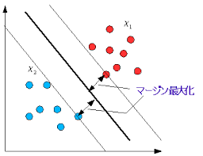

# SVM(サポートベクターマシン)
## SVMとは
SVM(Support Vector Machine)とは、機械学習の一手法。  
例えば、AとBの二種類のパターンがあったとしたら、AとBのパターンをどのように分けるのかを決めるのがパターン認識の目標となる。そのため、AとBの出現場所を調べ、分類の基準となる分類を決めることになる。このパターンの協会のことを「識別平面」と呼ぶ。正しい境界を決めることができれば、新しい未知のパターンが現れた時にも、AとBのどちらに分類したらいいのかを決定することができる。  
いくつもの境界線が引けるが、真ん中を通る線を決める時に、下記の図のようにマージンを最大化する。未知のパターンを分類する確率が高くなる。このような能力を「汎化能力」と呼ぶ。

## 肥満をSVMで当てる

[プログラム](./programs/bmi.ipynb)

## SVMの種類について
scikit-learnでは、三種類のSVMに対応している。SVC/NuSVC/LinearSVCの三種類。いずれも複数ラベルの分類に対応しており、SV[M]ではなく、SV[C]となっているのは、Classificationの頭文字。  
SVCとNuSVCは標準的な実装のSVM。この両者はエラー処理の仕方などが若干異なるものの、数学的には同じもの。それに対して、LinearSVCは線形カーネルに特化したSVM。計算が高速でオプションが豊富に用意されている。
